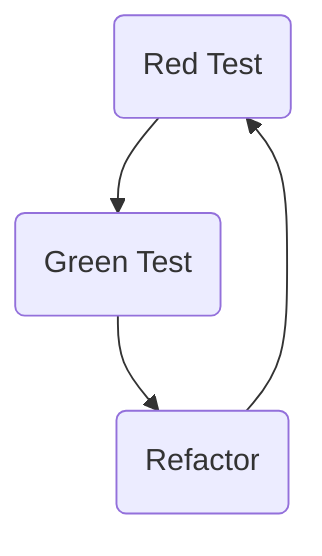

# Code Cleaning 101: Scrubbing Your Code

---
layout: statement
---

## If you didn't know something from this talk, and you will start using it, your code will become better

---
layout: image-right
image: 'avatar.jpg'
---
# `whoami`

- 
Pasha Finkelshteyn

- ≈10 years in <logos-java /> and <logos-kotlin-icon />
- Couple years in <logos-python />
- Couple years in <logos-javascript />
- <logos-twitter /> asm0di0
- <logos-mastodon-icon /> @asm0dey@fosstodon.org

Development, management, data engineering, testing…

---
layout: statement
---

# We all start somewhere

<!-- 
Usually it's not the best code we could write.

It should not stop us. We know that we can fight it.

The moment we realize that our code is imperfect is a moment when we need to scrub our code to make it cleaner
-->

---

# What is clean code?

- Easy to read, understand and maintain
- Well organized
- Follows coding conventions
- Avoid unnecessary abstractions
- Easy to change, test and extend

---
layout: statement
---

# Clean code is born from feedback

Feedback is the center of Agile

---
layout: image-right
image: 'kiss.png'
---

## Easy to read, understand and maintain

**KISS**: Keep It Simple, Soulmate

For example: 

- Measure cyclomatic complexity
- For pipelines
  - One pipeline operation on one line
  - Type hints on pipeline lengths

---

# Use meaningful names

<v-click>

Hungarian notation:

- `lAccountNum`: variable is a long integer (`l`);
- `arru8NumberList`: variable is an array of unsigned 8-bit integers (`arru8`);

</v-click>
<v-click>

We don't need it anymore.

- Use types if you need them. And checkers (i.e. `mypy`)
- Do not shorten. `AccountNumber` vs `AccountNum`

</v-click>

---
layout: image-right
image: 'contract.png'
clicks: 2
---

# Follow coding conventions

Some languages enforce them <logos-gopher />

<small v-click="1"><i>I don't like this idea</i></small>

I believe in freedom

- Agree on conventions
- Document them
- Follow them

Indentation, spacing, naming 
 

---

# Refactor

Today's IDEs give us powerful tools to refactor.

- Rename
- Extract methods and variables
- Extract superclasses/interfaces

Linters and IDEs show us duplicates, problematic parts of code, etc.

---
layout: two-cols
clicks: 1
---

## Write comprehensive tests

Tests help you to keep you codebase clean.

If test is hard to write — refactor!

Use tools like <logos-java /> [archunit](https://www.archunit.org/) or <logos-python /> [import-linter](https://import-linter.readthedocs.io/en/stable/)

_Some say TDD can help_ 

::right::

---

# Use linters, checkers. Constantly

Checking is not a one-time action. 

Run them in your IDE and in your CI.

# <simple-icons-sonarlint /> <vscode-icons-file-type-tslint /> <vscode-icons-file-type-markdownlint-ignore /> <file-icons-proselint /> <logos-eslint /> <vscode-icons-file-type-lintstagedrc />

---

# Get feedback. Give feedback.

https://conventionalcomments.org/

Bad <noto-cross-mark />

<v-click>

Good <noto-check-mark-button />

</v-click>

---

# What did we learn?

<v-clicks>

- Clean code makes code more readable
- Clean code is born from feedback
- Feedback from tools and people
- Code. Scrub. Repeat.

</v-clicks>

---

# Thank you!

- <logos-twitter /> asm0di0
- <logos-mastodon-icon /> @asm0dey@fosstodon.org
- <logos-google-gmail /> me@asm0dey.site
- <logos-linkedin-icon /> asm0dey
- <logos-telegram /> asm0dey
- <logos-whatsapp-icon /> asm0dey
- <skill-icons-instagram /> asm0dey
- <logos-facebook /> asm0dey

---
layout: end
---
